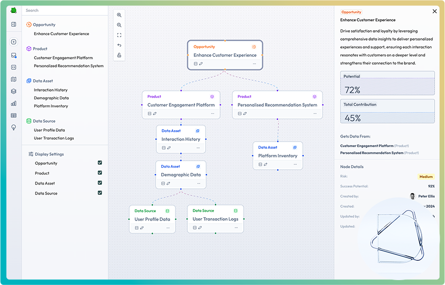

# React Flow Data Product Management Prototype



This repository contains a **mock prototype** built to explore the integration of [React Flow](https://reactflow.dev/) into a Data Product Management platform. The prototype was developed during my time as a Frontend Engineer at [Mindfuel.ai](https://mindfuel.ai).

## Project Purpose

The goal of this prototype was to:

- **Visualize** how lists of connected entities (such as data products, assets, and sources) could be improved using an off-the-shelf solution like React Flow.
- **Explore user interactions** with a graph-based interface for managing data products.
- **Gather initial feedback** from our user testing group via Slack to inform future product decisions.

## Tech Stack

### Frontend
- **React + Vite** – Modern React development with fast HMR
- **React Flow** – Interactive node-based graph visualization  
- **Tailwind CSS** – Utility-first CSS framework for rapid UI development
- **GSAP** – Animation library for smooth UI transitions
- **Tabler Icons** – Modern icon set for UI controls

### Backend & Database
- **Supabase** – PostgreSQL database with real-time features
- **Supabase JS Client** – Type-safe database operations
- **PostgreSQL** – Robust relational database for data persistence

### Deployment
- **Vercel** – Frontend hosting and CI/CD platform
- **Supabase Cloud** – Managed database hosting

## Features

- Interactive graph visualization of data products and their relationships
- Custom node types, edge types, and controls
- Responsive, animated side panels and control panels
- Inline editing of node details (title, risk, etc.)
- Node locking, custom connection handles, and more
- User feedback loop via Slack

## Deployment

- **Hosted on Vercel** for fast, reliable previews and production deployments
- **CI/CD** enabled for automatic builds and previews on every push

## Getting Started

### Prerequisites
- Node.js 18+ and npm/yarn
- A Supabase account (for database functionality)

### Setup Instructions

1. **Clone the repository:**
   ```bash
   git clone https://github.com/your-username/your-repo.git
   cd your-repo
   ```

2. **Install dependencies:**
   ```bash
   npm install
   # or
   yarn install
   ```

3. **Set up Supabase Database:**
   - Create a new project at [supabase.com](https://supabase.com)
   - Go to your project's SQL Editor
   - Run the SQL commands from `supabase/migrations/001_initial_schema.sql` to create tables and insert sample data
   - Get your project URL and anon key from Settings > API
   - See `supabase/README.md` for detailed setup instructions

4. **Configure Environment Variables:**
   Create a `.env` file in the root directory:
   ```env
   VITE_SUPABASE_URL=your_supabase_project_url
   VITE_SUPABASE_ANON_KEY=your_supabase_anon_key
   ```

5. **Run the development server:**
   ```bash
   npm run dev
   # or
   yarn dev
   ```

6. **Open [http://localhost:5173](http://localhost:5173) in your browser.**

### Quick Setup Helper
For a guided setup experience, run:
```bash
./supabase/setup.sh
```

This script will:
- Check your environment variables
- Display the SQL migration content for easy copying
- Provide step-by-step setup instructions

### Database Migration (Optional)
If you want to migrate from the hardcoded data to Supabase:
- The app includes a migration tool that will appear if no environment variables are detected
- Follow the on-screen instructions to migrate existing node data to your Supabase database

## Usage

- Click on nodes to view and edit details in the SideDrawer.
- Drag from any connector (top, bottom, left, right) to create relationships between nodes.
- Use the custom controls to zoom, fit view, reset, or lock node positions.
- Edit node titles and risk values inline for rapid prototyping.

## Caveats

- Not all side connectors are functional; some are present for orientation and user testing purposes only.
- This prototype omits features such as admin settings, a global navigation bar, and other production-level functionality.
- Please note: this is a mock prototype app intended for demonstration and feedback gathering.
- This is a desktop only experience

## Screenshot


## Feedback

This prototype was used to gather feedback from our user testing group in Slack. If you have suggestions or want to discuss the approach, feel free to open an issue or reach out!

---

## Design Engineer

**Peter Ellis**  
[petermarkellis@gmail.com](mailto:petermarkellis@gmail.com)
